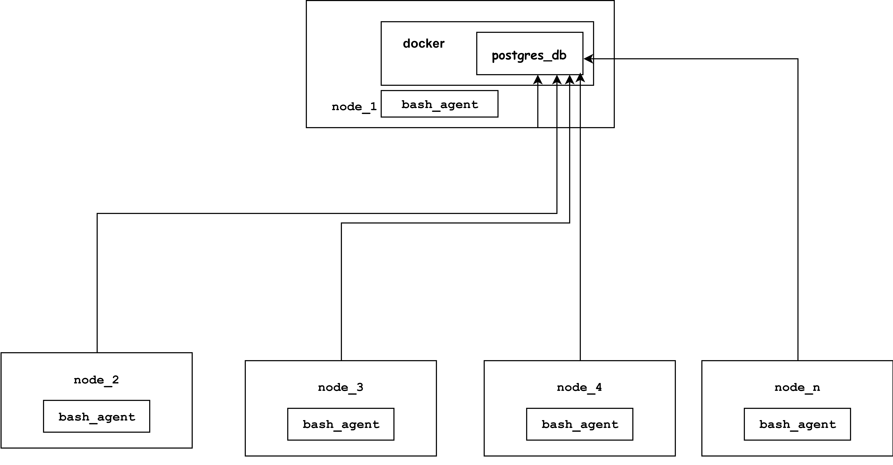

# Linux_Usage_Agent

## Introduction
**Linux_Host_Agent** is implemented to assist infrastructure managers for keeping track of hardware specifications and resource usage. It provides them with realtime quality data which helps to optimize efficiency and preplan future growth.
## Architecture and Design


There are two tables in our database host_info and host_usage
1. **host_info** contains hardware specifications for each node attached to the cluster.It contains values such as hostname,cpu_number its architecture, cpu model and its speed ,memory size, L2 cache size and timestamp.
2. **host_usage**  contains each node's performance data. which is being collected every minute. Data values include a timestamp, free memory, CPU idle, CPU kernel, disk input-output.

To gather data and add into above mentioned  tables we have two bash scripts host_info.sh and host_usage.sh 
host_info.sh is only run once to get the information of the system at start
host_usage.sh runs every minute using a scheduler in order to collect host usage data and insert it into the database.
To schedule host_usage run every minute, we create a crontab job which runs the host_usage.sh every minute
## Usage
1) Script init.sh  initialize database and create tables is postgresql database.
2) `host_info.sh` 
3) `host_usage.sh` usage
4) crontab setup

## Improvements

**Write at least three things you want to improve**
l1) handle hardware update
...
nux_Usage_Agent

## Introduction
What does this project do ... 


## Architecture and Design
1) Draw a cluster diagram with three hosts,a DB and agents
2) Describe tables (no sql code,just explain their usage)

table **host_info** is used to store information about the nodes of cluster.

table **host_usage** is used to store critical data related to a nodes performance

such as

* free diskspace
* cache size
* cpu usage

3) Describe scripts (no code,just explain their usage)

Scripts  **host_info.sh**  and **host_usage.sh** are taking the information and putting it 

into **postgresql** tables;

## Usage
1) how to init database and tables
2) `host_info.sh` usage
3) `host_usage.sh` usage
4) crontab setup


``` bash
#crontab scheduler script is developed using online crontab generator tools
# absolute path and logfile path is also provided
crontab -e
# generated code is pasted in text editor which appears after running above command
# make sure the bash file you runing a schedule on have executable permissions
# if not give permissions using command
chmod u+x filename
# or 
chmod 777 filename

```

## Improvements
There are several improvements which can be made in this application some of them are listed below.
1. An Emergency Alarm can be implemented which notify whenever system has reached a critical usage threshhold. Which helps to add more nodes to keep load undercontrol.
2. More usage statistics coould be logged which helps create better picture of cluster performance.
3. Automattic report generation can be added for executives for daily,weekly,monthly and yearly basis.
4. Capability to automatically detect hardware updates and log it can be added.
5. SQL Table can be normalized to query data efficently

**Write at least three things you want to improve**
l1) handle hardware update
...
